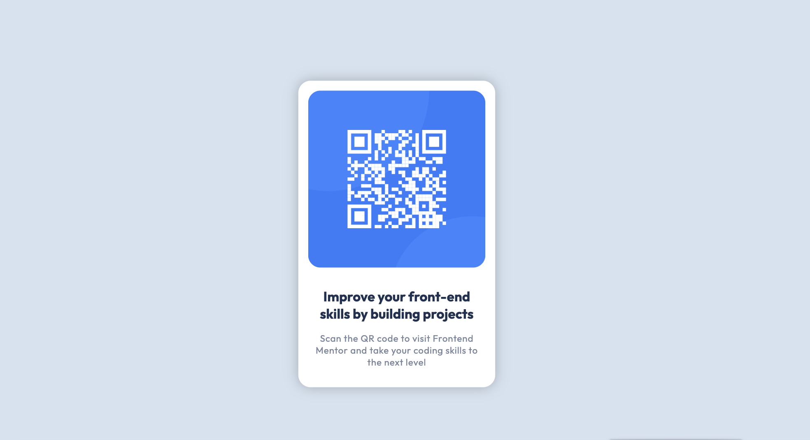

# Frontend Mentor - QR code component solution

This is a solution to the [QR code component challenge on Frontend Mentor](https://www.frontendmentor.io/challenges/qr-code-component-iux_sIO_H). Frontend Mentor challenges help you improve your coding skills by building realistic projects. 

## Table of contents

- [Overview](#overview)
  - [The challenge](#the-challenge)
  - [Screenshot](#screenshot)
  - [Links](#links)
- [My process](#my-process)
  - [Built with](#built-with)
  - [What I learned](#what-i-learned)
- [Author](#author)

## Overview

### The challenge

To build a QR Code UI Component.

### Screenshot

### Links

- Solution URL: [GitHub](https://github.com/svetikbaihe/QR-code-component.io.git)
- Live Site URL: [github-pages](https://svetikbaihe.github.io/QR-code-component.io/)

## My process

### Built with

- HTML5 markup
- CSS
- Flexbox

### What I learned

This is one of my first projects. It was the beginning of my learning journey and it's just as simple as it gets.

There are many flaws in the process, and my skills and techniques were not fully developed yet. Nevertheless, I am proud of how closely I matched the QR code to the initial design and for completing this challenge.

## Author

- Frontend Mentor -
  [@svetikbaihe](https://www.frontendmentor.io/profile/svetikbaihe)